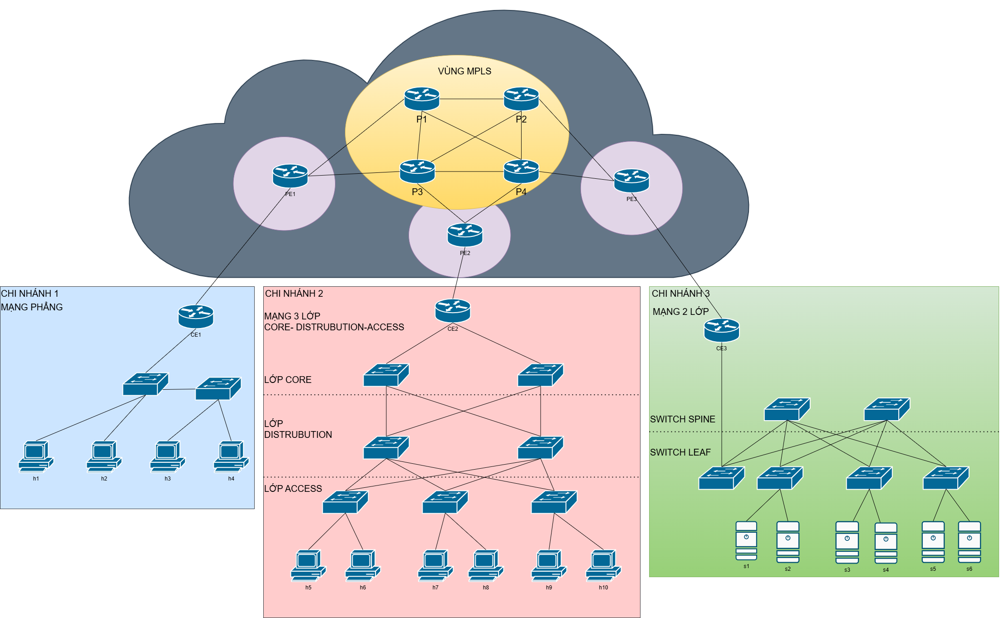

# Network Design Final Project 
## Thiết kế và triển khai mạng Metro Ethernet sử dụng MPLS cho kết nối đa chi nhánh doanh nghiệp

Đồ án cuối kỳ môn Thiết kế mạng (HK2/25-26) thực hiện bởi 52300266 - Lê Nguyễn Cát Tường.

## 📌 Giới thiệu
Đứng ở cả 2 góc nhìn là **Khách hàng (School Campus)** và **Nhà cung cấp dịch vụ (ISP)**, đi sâu tìm hiểu ***Multiprotocol Label Switching***, dự án mô phỏng và triển khai hệ thống mạng Metro Ethernet sử dụng công nghệ MPLS nhằm kết nối nhiều chi nhánh doanh nghiệp thông qua hạ tầng của nhà cung cấp dịch vụ. Dự án tập trung vào việc xây dựng mô hình mạng với các kiến trúc LAN khác nhau (flat, 2-layer, 3-layer) và đánh giá hiệu năng truyền dữ liệu giữa các chi nhánh. Thông qua việc áp dụng MPLS, hệ thống cho phép truyền tải nhiều loại giao thức khác nhau trên cùng một hạ tầng mạng (Multi-Protocol), đồng thời hỗ trợ định tuyến linh hoạt (Label-Switching), tăng tốc chuyển tiếp gói tin và đảm bảo phân tách lưu lượng hiệu quả trong môi trường mạng doanh nghiệp.

## 📂 Cấu trúc thư mục
- `source/`: Mã nguồn chính của dự án (Python/Shell scripts).
- `docs/`: Tài liệu hướng dẫn và báo cáo chi tiết.
- `image/`: Sơ đồ thiết kế mạng và hình ảnh minh họa kết quả.
- `report/`: Nơi để báo cáo và source latex (Nếu cần)
- `test_commands.md`: Danh sách các lệnh dùng để kiểm tra và vận hành hệ thống.

## 🚀 Hướng dẫn cài đặt & Chạy
### 1. **Yêu cầu hệ thống:** - Ubuntu/WSL2
   - Mininet / Ryu Controller (hoặc công cụ bạn dùng)
   - Python 3.x
   - Chạy lệnh setup
   ```bash
   # Lần đầu clone project về chạy: 
   sudo bash source/setup/auto_fix_env.sh

   # Những lần sau có thể chạy check_env để check không cần setup lại
   sudo bash source/setup/check_env.sh
   ```
   
### 2. **Chạy mô phỏng:**
   ```bash
   cd source
   sudo python3 <ten_file_chinh>.py
   ```

### 3. Kiểm tra:
Tham khảo các lệnh test tại [test_commands.md](./test_commands.md)

## 📊 Kết quả

### Sơ đồ hệ thống (Topology)


> **LƯU Ý:** Bạn có thể xem file thiết kế gốc tại thư mục `image/` để chỉnh sửa bằng draw.io.
> *PHẢI SỬA CHO ĐÚNG VỚI BÀI, DỰA TRÊN topology.py của riêng bạn nhé !*

### 4. Nhiệm vụ tiếp theo để hoàn thành bài:
- [ ] Xem lại và tìm hiểu bức tranh tổng thể của bài
- [ ] Hiểu về: Metro Ethernet MAN, MPLS, MPLS VPN (gồm có L2VPN VÀ L3VPN), VRF, BGP, MP BGP, OSPF,...
- [ ] Hoàn thành tool.py đo 4 nội dung: Throughput, Delay, Packet loss, Jitter. Cần xuất được bảng, sơ đồ để thống kê (tham khảo [tool.py](./source/tool.py))
    + Kiểm tra Traceroute: Xác nhận gói tin có đi qua các nhãn (labels) MPLS không.
    + Đo Throughput: Sử dụng iperf đo băng thông giữa các chi nhánh.
    + Đo Delay/Jitter/Loss: Sử dụng ping (in kết quả thô) để lấy thông số độ trễ và tỷ lệ mất gói.
    + Stress Test: Tăng tải mạng (bằng iperf) để xem sự thay đổi của độ trễ và mất gói.
    + Tích hợp các chức năng in ra các file ảnh và file .csv như tool đã tham khảo.
- [ ] Viết báo cáo Latex -- xem kỹ [đề bài](./docs/debai.txt) để thực hiện. Hãy tìm và chọn lọc các lệnh *show, traceroute, iperf,...* để chứng minh đã cấu hình được và screenshot bỏ vào báo cáo tăng độ tin cậy nhé !

### 5. Sản phẩm cuối cùng (đề xuất): Tất cả zip lại đặt tên FINAL_MSSV_HOTEN.zip
- **/source:** toàn bộ code liên quan, bao gồm: topology.py, config_backbone.py, config_branch1.py, config_branch2.py, config_branch3.py, tool.py, các folders giữ test_results từ tool.py,...
- **/report:** Report.pdf, main.tex
- **/image:** hình ảnh topology (draw.io) và hình ảnh liên quan (nếu có)
- ***Lưu ý:***
  + Đây chỉ là đề xuất, có thể bố trí bài nộp theo cách của riêng bạn.
  + Bám sát đề và đừng nộp những file không liên quan như **folder /setup** bạn nhé ! 
---
### 📚 Tài liệu tham khảo
* **Dự án gốc:** [TKM Final Project](https://github.com/dungabx/TKM/tree/main/final) – bởi `@dungabx`.
* **Mô tả:** Tham khảo cấu trúc thư mục và cách triển khai logic cho sơ đồ mạng trong bài tập lớn.

### Thông tin tác giả
* **Họ tên:** Lê Nguyễn Cát Tường
* **Tổ chức:** Tôn Đức Thắng University (TDTU)
* **Năm thực hiện:** © 2026
---
Hi vọng mọi kiến thức sẽ được bạn học tiếp nhận một cách đơn giản và vui vẻ. 
Rất mong nhận được sự thảo luận của bạn học khi có thắc mắc hoặc có vấn đề cần chỉnh sửa qua zalo^^
Cảm ơn vì đã ghé thăm, see ya~~~

🚀 **You are what you do!**

